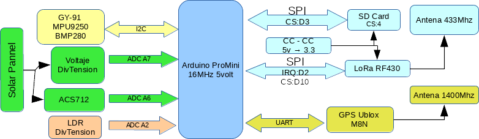

# FinTrackLegacy
Baliza de telemetria para vehículos radiocontrol

## Componentes

| Tipo de componente | Descripción | Donde comprarlo | Coste |
|:------------------:|:-----------:|:---------------:|:------:|
| **MMU:**      |  Arduino Compatible Nano 5V Pro  Mini ATmega 328   | [TxHang](https://www.ebay.es/itm/5V-Pro-Mini-Atmega168-Module-16M-For-Arduino-Compatible-Nano-replace-Atmega328/401085596792?hash=item5d62908478:g:CosAAOSw1BlZVNWF:rk:34:pf:0)   |  1,6 €      |
| **GPS:**        |   Ublox M8N          |                 |   15 €     |
| **IMU:**        |   MPU9250 con sensor de presion BMP280 GY91          |  [TxHang](https://www.ebay.es/itm/MPU9250-BMP280-GY-91-10DOF-Acceleration-Gyroscope-Compass-Nine-Shaft-Sensor/201511414775?hash=item2eeb042bf7:g:GOAAAOSwiHpaRMU8:rk:2:pf:0)               |   4 €     |
| **COMM:**      |  433MHz LoRa Device SX1278           |   [TxHang](https://www.ebay.es/itm/433MHz-LoRa-SX1278-long-range-RF-wireless-module-DRF1278F-For-Arduino/401241805025?hash=item5d6be010e1:g:xtsAAOSwcBRbztoL:rk:1:pf:0)              |   3,6 €     |
| **VOLT:**        | Divisor de tension    |                 |   0,25 €     |
| **AMP:**        | Current Sensor Module 20A ACS712            |   [TxHang](https://www.ebay.es/itm/New-design-20A-range-Current-Sensor-Module-ACS712-Module-Arduino-module-ACS712T/181026550196?hash=item2a2605f1b4:g:lmwAAOSweXFb7S7H:rk:2:pf:0)              |    1,6 €    |
 **LUM:**        |   LDR con divisor de tensión          |                 |  0,5 €         |
| **MEM:**      |   Socket Tarjeta MicroSD          |  [TxHang](https://www.ebay.es/itm/10PCS-TF-Micro-SD-Card-Module-Mini-SD-Card-Module-Memory-Module-Arduino-ARM-AVR/400995693568?hash=item5d5d34b400:g:WvIAAOSwsTxXiEqz:rk:1:pf:0)               |   0,5 €       |
| **CONVERTER:**      |   4.5v-7v a 3.3 V  fuente de alimentación  Ams1117   |  [TxHang](https://www.ebay.es/itm/10PCS-New-4-5V-7V-to-3-3V-AMS1117-3-3V-Power-Supply-Module-AMS1117-3-3/201089418957?hash=item2ed1dd06cd:g:dBIAAOSwKLVbYnR6:rk:10:pf:0)               |   0,2 €       |
| **CON:**        | Conectores XT60            | [TxHang](https://www.ebay.es/itm/2PCS-of-XT60-Battery-Male-Connector-Female-Plug-with-Silicon-14-AWG-Wire/311835523055?hash=item489ad877ef:g:GfAAAOSwB-1Y28Un:rk:3:pf:0)                 |   1,1 €     |
| **PCB:**        |  PCB microperforada de 50x70 mm           | [TxHang](https://www.ebay.es/itm/5PCS-Double-Side-Prototype-PCB-Tinned-Universal-Breadboard-5x7-cm-50mmx70mm-FR4/200932697658?hash=item2ec885a63a:g:e2wAAOSw4apbRrru:rk:2:pf:0)                 |  0,25 €      |

## Diseño conceptual

El sistema esta compuesto de un arduino Nano al que se le han acoplado los sensores a sus diferentes puertos.

Hay que señalar que es necesario colocar un regulador de tension para bajar de 5 voltios de la fuente a los 3.3 necesarios para el integrado LoRa.

El sistema esta alimentado por una fuente de potencia de 5,4 voltios y consume unos 150 mA con un peso de unos 180gr

## Diagrama KiCad

## Montaje

Se utiliza una placa de doble cara microperforada de paso 2,5 mm sobre la que se sueldan los diferentes componenetes.

Se intenta, en lo posible, separar los elementos de adquisición de los de emision y potencia, ya que estos podrian perturvar las lineas analógicas de las mediciones.

Se integra dentro de una caja estanca de 70x90.

Se integra con el vehículo radiocontrol "pinchandose" en medio de la alimentacíon y la controladora. Por un lado se conecta un panel solar o batería principal y por el otro el sistema de control. De esta manera, el dispositivo monitoriza la energia consumida del vehículo.

## Firmware

### Requerimientos
El firmware require de las siguentes librerias para compilar:
Arduino
SPI
SdFat
NeoGPS
MPU9250

### programación
Seleccionar:
Placa "Arduino Pro or Pro Mini"
Procesador: ATMega328P (16Mhz, 5v)
Programador: AVRISP mkII

## Formato de datos de salida
El formato de guardado de los datos sera un fichero en ASCII con extension .log
Solo guardara los datos una vez que haya cogido posicion GPS, y el nombre del fichero sera la fecha actual.
Escribirá una linea por cada registro. Con la siguiente estructura: datos separados por comas

#FTRCK, ms_from_start, RSSI, gps_HDOP, gps_latitude, gps_longitude, gps_heading, bearing_avg, bearing_std, voltage_batt_avg, voltage_batt_std, amp_batt_avg, amp_batt_std, pressure_avg, pressure_std, ligth_avg, ligth_std,accX_avg, accX_std, accY_avg, accY_std, accZ_avg, accZ_std, gyrX_avg, gyrX_std, gyrY_avg, gyrY_std, gyrZ_avg, gyrZ_std, mgX_avg, mgX_std, mgY_avg, mgY_std, mgZ_avg, mgZ_std

## ROADMAP
- [X] Descripcion de componentes
- [ ] Circuito Kicad
- [ ] Circuito físico
- [ ] Firmware
- [ ] Software Cliente 

