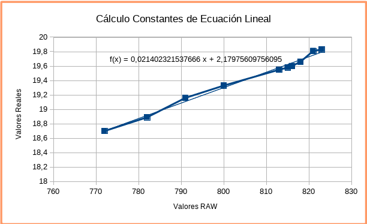
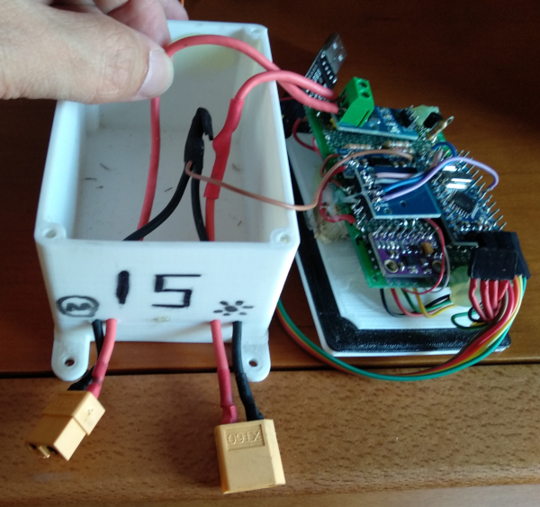
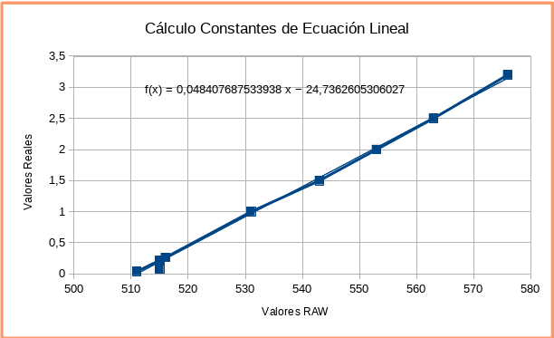
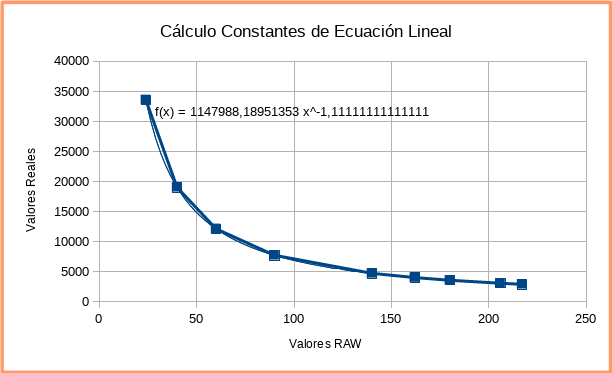
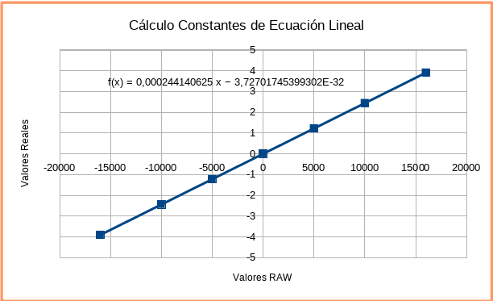
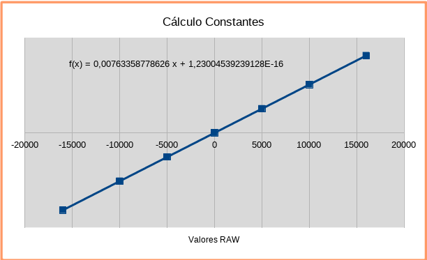
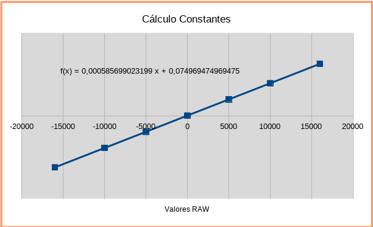
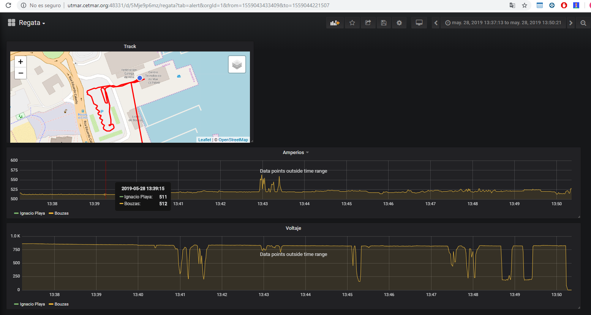

# FinTrackLegacy
Baliza de telemetría para vehículos radiocontrol

## Componentes

| Tipo de componente | Descripción | Donde comprarlo | Coste |
|:------------------:|:-----------:|:---------------:|:------:|
| **MMU:**      |  Arduino Compatible Nano 5V Pro  Mini ATmega 328   | [TxHang](https://www.ebay.es/itm/5V-Pro-Mini-Atmega168-Module-16M-For-Arduino-Compatible-Nano-replace-Atmega328/401085596792?hash=item5d62908478:g:CosAAOSw1BlZVNWF:rk:34:pf:0)   |  1,6 €      |
| **GPS:**        |   Ublox M8N          |                 |   15 €     |
| **IMU:**        |   MPU9250 con sensor de presión BMP280 GY91          |  [TxHang](https://www.ebay.es/itm/MPU9250-BMP280-GY-91-10DOF-Acceleration-Gyroscope-Compass-Nine-Shaft-Sensor/201511414775?hash=item2eeb042bf7:g:GOAAAOSwiHpaRMU8:rk:2:pf:0)               |   4 €     |
| **COMM:**      |  433MHz LoRa Device SX1278           |   [TxHang](https://www.ebay.es/itm/433MHz-LoRa-SX1278-long-range-RF-wireless-module-DRF1278F-For-Arduino/401241805025?hash=item5d6be010e1:g:xtsAAOSwcBRbztoL:rk:1:pf:0)              |   3,6 €     |
| **VOLT:**        | Divisor de tensión    |                 |   0,25 €     |
| **AMP:**        | Current Sensor Module 20A ACS712            |   [TxHang](https://www.ebay.es/itm/New-design-20A-range-Current-Sensor-Module-ACS712-Module-Arduino-module-ACS712T/181026550196?hash=item2a2605f1b4:g:lmwAAOSweXFb7S7H:rk:2:pf:0)              |    1,6 €    |
 **LUM:**        |   LDR con divisor de tensión          |                 |  0,5 €         |
| **MEM:**      |   Socket Tarjeta MicroSD          |  [TxHang](https://www.ebay.es/itm/10PCS-TF-Micro-SD-Card-Module-Mini-SD-Card-Module-Memory-Module-Arduino-ARM-AVR/400995693568?hash=item5d5d34b400:g:WvIAAOSwsTxXiEqz:rk:1:pf:0)               |   0,5 €       |
| **CONVERTER:**      |   4.5v-7v a 3.3 V  fuente de alimentación  Ams1117   |  [TxHang](https://www.ebay.es/itm/10PCS-New-4-5V-7V-to-3-3V-AMS1117-3-3V-Power-Supply-Module-AMS1117-3-3/201089418957?hash=item2ed1dd06cd:g:dBIAAOSwKLVbYnR6:rk:10:pf:0)               |   0,2 €       |
| **CON:**        | Conectores XT60            | [TxHang](https://www.ebay.es/itm/2PCS-of-XT60-Battery-Male-Connector-Female-Plug-with-Silicon-14-AWG-Wire/311835523055?hash=item489ad877ef:g:GfAAAOSwB-1Y28Un:rk:3:pf:0)                 |   1,1 €     |
| **PCB:**        |  PCB microperforada de 50x70 mm           | [TxHang](https://www.ebay.es/itm/5PCS-Double-Side-Prototype-PCB-Tinned-Universal-Breadboard-5x7-cm-50mmx70mm-FR4/200932697658?hash=item2ec885a63a:g:e2wAAOSw4apbRrru:rk:2:pf:0)                 |  0,25 €      |


## Diseño conceptual


El sistema está compuesto de un arduino Nano al que se le ha acoplado los sensores a sus diferentes puertos.

Hay que señalar que es necesario colocar un regulador de tensión para bajar de 5 voltios de la fuente a los 3.3 necesarios para el integrado LoRa.

El sistema esta alimentado por una fuente de potencia de 5,4 voltios y consume unos 70mA (150mA si el LoRa esta activado) con un peso de unos 180gr


## Diagrama KiCad

## Montaje

Se utiliza una placa de doble cara microperforada de paso 2,5 mm sobre la que se sueldan los diferentes componentes.

Se intenta, en lo posible, separar los elementos de adquisición de los de emisión y potencia, ya que estos podrían perturbar las líneas analógicas de las mediciones.

Se integra dentro de una caja estanca de 70x90.

Se integra con el vehículo radiocontrol "pinchándose" en medio de la alimentación y la controladora. Por un lado se conecta un panel solar o batería principal y por el otro el sistema de control. De esta manera, el dispositivo monitoriza la energía consumida del vehículo.

## Firmware

### Requerimientos
El firmware require de las siguentes librerias para compilar: Arduino, SPI, SdFat, NeoGPS, GY91_I2C

Estas librerías estan incluidas en el repositorio.

### programación
Seleccionar:
- Placa "Arduino Pro or Pro Mini"
- Procesador: ATMega328P (16Mhz, 5v)
- Programador: AVRISP mkII

### Configuración del GPS
Actualmente se utiliza un GPS M8N de la marca Ublox. Este requiere de una configuración para funcionar con el firmware. Se ha de subir por medio de la aplicacion [U-Center](../tools/u-center_v8.29.exe)   el siguente archivo: [Config_M8N](UbloxM8N__rmc_gga_gst_2hz.txt)
Si por alguna razon, este GPS no pudiese ser el mismo modelo, hay que configurarlo como:
- protocolo NMEA
- Frecuencia 2Hz (500ms)
- Tramas activas: GGA, RMC y GST

## Formato de datos de salida
El formato de guardado de los datos sera un fichero en ASCII con extension .csv
Guarda los datos con una frecuencia de 1 segundo. 
Escribirá una linea por cada registro. Con la siguiente estructura: datos separados por comas

Cabezera identificativa de las tramas:
```
ID,timestamp_ms,year,month,day,hour,min,sec,lat_E7,lon_E7,alt_cm,lat_err_cm,lon_err_cm,alt_err_cm,volt_avg,volt_std,amp_avg,amp_std,ldr_avg,ldr_std,pres_avg_hpa,pres_std,acx_avg,acx_std,acy_avg,acy_std,acz_avg,acz_std,gyx_avg,gyx_std,gyy_avg,gyy_std,gyz_avg,gyz_std,mgx_avg,mgx_std,mgy_avg,mgy_std,mgz_avg,mgz_std
```
La descripción de cada uno de estos valores es la siguente:
- **ID:** El código identificativo de la trama
- **timestamp_ms:** Los milisegundos desde que se enciende el dispositivo
- **year:** El año, obtenido por el GPS (20-1 si no hay dato)
- **month:** El mes, obtenido por el GPS (-1 si no hay dato)
- **day:** El día, obtenido por el GPS (-1 si no hay dato)
- **hour:** La hora, obtenido por el GPS (-1 si no hay dato)
- **min:** El minuto, obtenido por el GPS (-1 si no hay dato)
- **sec:** El segundo, obtenido por el GPS (-1 si no hay dato)
- **lat_E7:** Latitud en formato grados decimales E-7 (428765432->42.8765432), obtenido por el GPS (-500 si no hay dato)
- **lon_E7:** Longitud en formato grados decimales E-7 (88765432->8.8765432), obtenido por el GPS (-500 si no hay dato)
- **alt_cm:** La altura sobre la hipotética esfera que simula la tierra. En centimetros. (-1 si no hay dato)
- **lat_err_cm:**  El error en cm de la posición de la latitud (si no hay dato, 32000)
- **lon_err_cm:** El error en cm de la posición de la longitud (si no hay dato, 32000)
- **alt_err_cm:** El error en cm de la posición de la altura (si no hay dato, 32000)
- **volt_avg:** El valor medio de las medidas tomadas durante un segundo de la entrada de voltaje. Medida absoluta
- **volt_std:** La desviación estandar de las medidas de voltaje
- **amp_avg:** El valor medio de las medidas tomadas durante un segundo de la entrada de corriente. Medida absoluta
- **amp_std:** La desviación estandar de las medidas de corriente
- **ldr_avg:** El valor medio de las medidas tomadas durante un segundo de la entrada de intensidad de luz. Medida absoluta
- **ldr_std:** La desviación estandar de las medidas de intensidad luminosa
- **pres_avg_hpa:** El valor medio de las medidas tomadas durante un segundo de la presión barométrica. Medida hPa.
- **pres_std:** La desviación estandar de las medidas de presión barométrica
- **acx_avg:** El valor medio de las medidas tomadas durante un segundo de la aceleración en el eje X. Medida absoluta.
- **acx_std:** La desviación estandar de las medidas de aceleración en el eje X
- **acy_avg:** El valor medio de las medidas tomadas durante un segundo de la aceleración en el eje Y. Medida absoluta.
- **acy_std:** La desviación estandar de las medidas de aceleración en el eje Y
- **acz_avg:** El valor medio de las medidas tomadas durante un segundo de la aceleración en el eje Z. Medida absoluta.
- **acz_std:** La desviación estandar de las medidas de aceleración en el eje Z
- **gyx_avg:** El valor medio de las medidas tomadas durante un segundo del giróscopo en el eje X. Medida absoluta.
- **gyx_std:** La desviación estandar de las medidas de giróscopo en el eje X
- **gyy_avg:** El valor medio de las medidas tomadas durante un segundo del giróscopo en el eje Y. Medida absoluta.
- **gyy_std:** La desviación estandar de las medidas de giróscopo en el eje Y
- **gyz_avg:** El valor medio de las medidas tomadas durante un segundo del giróscopo en el eje Z. Medida absoluta.
- **gyz_std:** La desviación estandar de las medidas de giróscopo en el eje Z
- **mgx_avg:** El valor medio de las medidas tomadas durante un segundo del magnetómetro en el eje X. Medida absoluta.
- **mgx_std:** La desviación estandar de las medidas de magnetómetro en el eje X
- **mgy_avg:**  El valor medio de las medidas tomadas durante un segundo del magnetómetro en el eje y. Medida absoluta.
- **mgy_std:** La desviación estandar de las medidas de  magnetómetro en el eje Y
- **mgz_avg:**  El valor medio de las medidas tomadas durante un segundo del magnetómetro en el eje Z. Medida absoluta.
- **mgz_std:** La desviación estandar de las medidas de  magnetómetro en el eje Z

Ejemplo de trama con datos nulos/falsos:
```
FTLN,2732,20-1,-1,-1,-1,-1,-1,-500,-500,-500,3008,3008,3008,0,0,511,0,553,0,1096,0,35,12,-188,17,-3969,31,-30,1,11,1,24,0,-179,5,319,7,-85,4
```
Ejemplo de trama con datos correctos:
```
FTLN,700632,2019,2,26,15,1,59,422276422,-87514658,1150,790,240,500,0,0,512,0,480,47,1096,0,-993,189,-2552,1332,-1786,1767,-1507,718,327,162,233,140,45,36,353,22,219,139
```

Se adjunta tambien un fichero completo de salida de los datos:
[Fichero de ejemplo de salida](data_16.csv)

## Tratamiento de datos
Por un tema de calibración y exactitud de las medidas adquiridas, los datos guardados en la tarjeta SD son lo mas proximos a los valores RAW. 
Con esto, mejoramos la capacidad del sistema para realizar todas las operaciones en la menor cantidad de tiempo, y no contaminamos las medidas adquiridas con calculos particulares que podrian estar erroneos sin una calibración de los instrumentos.

Se requiere por tanto una trasfromación de los datos para obtener unos valores entendibles por el usuario.

Para ello se puede utilizar un script python para la trasformación de los datos o una plantilla LibreOffice para la apliacion de las formulas de calibración.

- Archivo Python
- Hoja de cálculo: [FinTrackLegacyData](FinTrackLegacyData.ods)

En la hoja de cálculo, tambien se incluyen las herramientas para generar los valores de las constantes necesarios para realizar las trasformaciones.


### Conversion Voltaje
La adquisición del voltaje se hace por medio de un divisor de tension conectado al polo positivo del panel solar y a su masa. La salida de este divisor se introduce en el PIN  A7 del Arduino.
El divisor esta compuesto por dos resistencias de recision 1% R1:10 y R2:40K

Teoricamente la conversion de RAW a voltaje seria:
Voltaje=(RAW*5/1023)*(10+40)/10

Se ha calibrado un tracker con datos reales y la funcion quedaria asi:
ecuacion lineal  y=m*x+b donde m=0,021402321537666 y b=2,17975609756098



Se muestran a continuación una tabla comparativa de los resultados:

| Valor RAW | Valor Real | Valor Teórico |
|:------------------:|:--------------:|:--------------:|
|772	| 18,7    | 18,866  |
|791  | 19,16  |19,330  |
|782  | 18,89  | 19,110  |
|800  | 19,33  | 19,550  |
|823  | 19,83  | 20,112  |
|821  | 19,81  | 20,063  |
|818  | 19,66  | 19,990  |
|816  | 19,6  | 19,9413  |
|815  | 19,58  | 19,916  |
|813  | 19,55  | 19,868  |


### Conversión de corriente
La adquisición de la corriente se hace por medio de un circuito integrado ACS712ELCTR-20A-T conectado en serie al polo positivo del panel solar. La salida de este divisor se introduce en el PIN  A6 del Arduino.
Este circuito integrado teoricamente mide entre -20 y +20 amperios, en la franja de [0,5] voltios, por lo que serian unos 100mA/Volt. En la foto siguiente se puede apreciar el conexionado, entrando el polo positivo del panel solar por la parte izquierda y saliendo por la derecha hacia el ESC/Motor.



Teoricamente la conversion de RAW a corriente seria:
Corriente=((RAW*5/1023)-2,5)/0,1

Se ha calibrado un tracker con datos reales y la funcion quedaria asi:
ecuacion lineal  y=m*x+b donde m=0,048407687533938 y b= -24,7362605306027


Se muestran a continuación una tabla comparativa de los resultados:

| Valor RAW | Valor Real | Valor Teórico |
|:------------------:|:--------------:|:--------------:|
|511| 0,041| -0,024 |
|515| 0,22 |0,171|
|516| 0,263| 0,219|
|531| 1| 0,953|
|543| 1,5| 1,539|
|553| 2| 2,028|
|563| 2,5 | 2,517|
|576| 3,2 | 3,152|
|515| 0,08 | 0,171|


### Conversión de Intensidad Luminosa
La adquisición de la intensidad luminosa se hace por medio de una resistencia fotoelectrica, LDR [GL5537], conectada a un divisor de tension. La salida de este divisor se introduce en el PIN  A2 del Arduino.
El divisor esta compuesto por dos resistencias, una fija y la otra el LDR: R1:10 y R2:LDR

Teoricamente la conversion de RAW a Lux seriauna ecuación logaritmica sacada del Datasheet del LDR:
lux = 1.0+((log10(29.0)-log10(sensorValue * (5.0 / 1023.0)))/0.9)
lux = pow(10.0, lux2) -> inversa de log10
donde 29 es la resistencia a 10 lux [150K typical] , sacado del datasheet.

Como en este caso no tenemos ningun aparato para poder calibrar el sensor, vamos a estimar el calculo de los Lux con la exposicion a un dia de luz solar a las 11:30 de la mañana. Teoricamente a plean luz del dia, los lux varian entre 100.000 y 30.000, asi que neustro sensor deberia estar en ese rango.

Ademas, se probara que ante la aparaicion de nubes, este sensor responde con coherencia.

Adecuando el dato de la resistencia a 10 Lux, estimamos que esta sera aproximadamente 175, para que nos de unos Lux coherentes a plena luz del dia.

La funcion, por tanto, quedaria asi:
ecuacion potencial y=b*x^a donde m = -1,11111111111111 y  b= 1147988,18951353



Se muestran a continuación una tabla teorica resultante:

| Valor RAW | Valor Real | 
|:------------------:|:--------------:|
|24| 33602,3285394608 |
|40| 19048,9377703399 |
|60| 12139,8636383701 |
|90| 7736,7195449446 |
|140| 4735,33505765633 |
|162| 4026,4354145241 |
|180| 3581,61649136152 |
|206| 3083,0022514423 |
|217| 2909,85299518942 |


### Conversión de Acelerómetro
La medida de aceleración es adquirida a traves del sensor MPU9250, el cual esta configurado a 8G, lo que nos da 4096 counts/g.

Calculado la ecuacion correspondiente:



### Conversión de Giróscopo
La medida de giroscopo es adquirida a traves del sensor MPU9250, el cual esta configurado a 250º/s, lo que nos da 131 counts/(º/s).

Calculado la ecuacion correspondiente:



### Conversión de Magnetómetro
La medida de aceleración es adquirida a traves del sensor MPU9250, para el cual, senecesita realizar esta operaciónpara sacar los microTeslas:
magScaleX = (((RAW) - 128)/(256) + 1) * 4912 / 32760

Calculado la ecuacion correspondiente:




## Visualización Web
Se ha creado tambien un visualizador WEB para graficar los datos a traves de una plataforma interactiva.



En este caso solo haria falta subir el fichero .csv generado por el Tracker y automaticamente se verian los datos en la WEB.

## Firmware de Calibración
Para calibrar el dispositivo Tracker, se ha creado un firmware especifico para habilitar la telemetria en tiempo real a traves del puerto serie.
En este caso, se desabilita el GPS, y a traves de este conexionado (identico al que sirve para su programacion), se puede monitorizar los datos en tiempo real del Tracker.

Solo es necesario, si se quiere realizar una calibracion exacta para cada dispositivo. Sino, con los datos proporcionados en el documento, seria suficiente.

## ROADMAP
- [X] Descripción de componentes
- [ ] Circuito KiCad
- [ ] Circuito físico
- [X] Firmware
- [X] Software Cliente 
- [X] Visor Web


